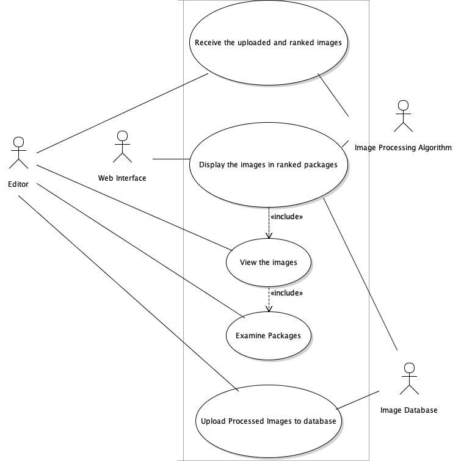

## Created By: Grant
#### Reviewed By: Alex, Xin

# Title:
#### Editor Reviewing the Photographs

# Description:
>This use case, shows how the editor reviews the images post processing. The editor will be allowed to view the ranked images after processing. The web interface will display the images after the algorithm ranks them and sends them through. The Editor will see a list of images that will be ranked on a scale according to picture quality such as brightness, focus, and emotion of image.
The images will be stored in groups ranking from 1 – 5, 1 being the best quality and 5 being the worst. From this the editor will be allowed to view the images in each package as well as see what percentage of images from the dataset are in what group. The editor will also be able to make a choice as to which images to keep and which images will be removed. The editor will also have the option to move the images to a database for long term storage.

# Triggers:
+ Images Received after ran through the image processing algorithm

# Actors:
+ Editor
+ Image Processing Algorithm
+ Image Database
+	Web Interface

# Preconditions:
+ The Photographer uploaded images to the algorithm
+ The Images were processed through the algorithm 	
+ The Images are displayed in ranked order

# Main Success Scenario (Goals):
+ The overall goal of this use case would be for the editor to be able to view the ranked images and view the top images and upload those images to a database for storage.

# Alternate Success Scenarios:
+ An alternate success scenario would be the editor viewing the lowest ranked images to make an assessment on why those images are the lowest ranked and compare them to the top images.

# Failed End Condition:
+ The images are not in ranked order and displayed for the editor to see and make assessments.

# Extensions:
+ Editor can choose the top images and display what percentage of the overall images made it into each ranking.

# Steps of Execution (Requirements):
1. Receive the uploaded and ranked images
2. Display the images in ranked packages
3. Editor can click on packages to view the ranks
4. Editor can pick a package to upload to the database

# Use Case:

# Dependent Use Cases:
Image Processing Use Case 
