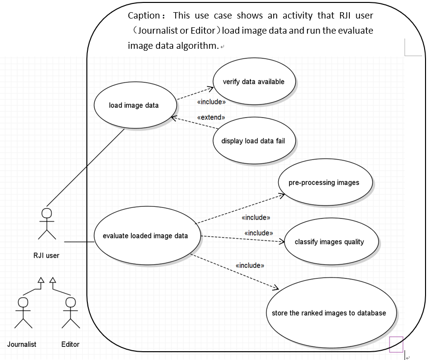

## Created By: Xin
#### Reviewed By: Alex, Grant

# Title:
#### Load and rank the image data

# Description:
>This use case shows how the RJI user（Journalist or Editor）can execute the image quality assessment algorithm. First of all, RJI user select the image data set and load it, user should input some filter conditions to select the image data from the database. After the data selected, user can evaluate the quality of selected image data. During the image quality assessment, the algorithm includes pre-processing images, classify images quality and store all the ranked images in the database. The RJI user could select ranked image data from database.

# Triggers:
+ The RJI user load images to be evaluated, click the “evaluate images” button to start the assessment algorithm.

# Actors:
+ RJI user (Journalist or Editor)

# Preconditions:
+ The user uploaded images to the database.
+ The image data loaded success before evaluate.

# Main Success Scenario (Goals):
+ The image data would be ranked from 1-5,1 being the best quality and 5 being the worst. The result would be stored in the database.

# Alternate Success Scenarios:
+ Images are filtered correctly by the algorithm

# Failed End Condition:
+ When load image data, if the data does not exist, it will shows ”load data failed”

# Extensions:
+ N/A

# Steps of Execution (Requirements):
1. RJI user load image data from database.
2. RJI user click the “evaluate loaded data” button after data loaded success.

# Use Case:

# Dependent Use Cases:
+ Use case: Upload Photos use case 
