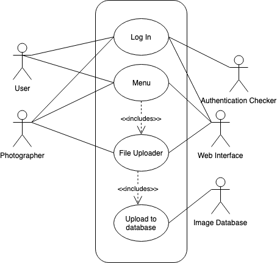

## User upload and sign in process
Created By Alex Davis -
Reviewed by Grant Harrison and Xin Cui

## Description
>This is the process in which the user, most likely the photographer, will upload the data into the application. This is also the main sign in process for any user needing to access the data. Each user will need a username and password to access the application. If the user has valid log in credentials, they will be brought to the main menu. Users that need to upload photos will then navigate to the upload page where they will be prompted to upload the photos. Before uploading, the user will choose which category of photo they are uploading(Sports, School, etc). The photos are then uploaded to the photo database.

## Triggers
+ The user needing to sign in, as well as, the photographer having the data ready to upload starts this use-case.

## Actors
+ Photographer
+ User
+ Authentication Checker
+ Image Database
+ Web Interface

## Preconditions
+ Photographer takes photos
+ Editor has need to review photos
+ User needs access to photos

## Main Success Scenario (Goals)
+ Successful log in to system
+ Successful upload of photos

## Alternate Success Scenarios
+ Successfully blocks users with invalid log in credentials

## Failed End Condition
+ Upload of photos Failed
+ Upload failed due to file size
+ Upload failed due to invalid file type
+ Log in failed when user has valid credentials

## Extensions
+ The photographer has the time of upload stored in the system for review in a future time

## Steps of Execution (Requirements)
+ User enters username and password
+ If the user has photos to upload, select the upload page
+ Navigate to the photos on the device, choose which category of photo they are, and click "Upload"

## A use case diagram

## Dependent Use Cases
+ N/A
